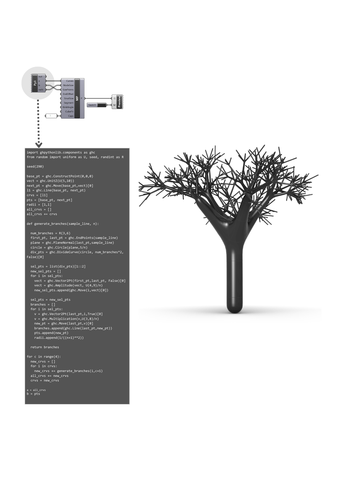

# Generative-Design-with-Python3
Generative branching structures created with recursive Python scripting in Grasshopper.

# Python 3 inside Grasshopper! 

In this project, I built a model to demonstrate how recursive functions work. The tree-like form seen in the image is the visual output of this logic. 💡

### The Workflow:
First, I wrote a script using the **Python 3 (Py3)** component in Grasshopper. This code relies on recursive logic to generate the overall structure and the network of branching lines.

Here are the variables for this section:
🔸 **Inputs:** Random Seed, Base Point, and Growth Logic (Length and Angle)
🔹 **Outputs:** Generative Curves

Ultimately, for a better visual representation, I connected the curves generated by the code to the **Multipipe** component (which is a SubD tool in Grasshopper) to create a continuous volume over the lines. 🎯 

By changing the seed variable in the Python code and tweaking the pipe settings, different forms take shape.

---

### 🛠️ Tools Used:
* **Rhinoceros 3D / Grasshopper**
* **Python 3 / Py3 Component** (for coding the recursive functions and generating the line network)
* **Multipipe Component** (for visual representation and adding volume to the lines)
